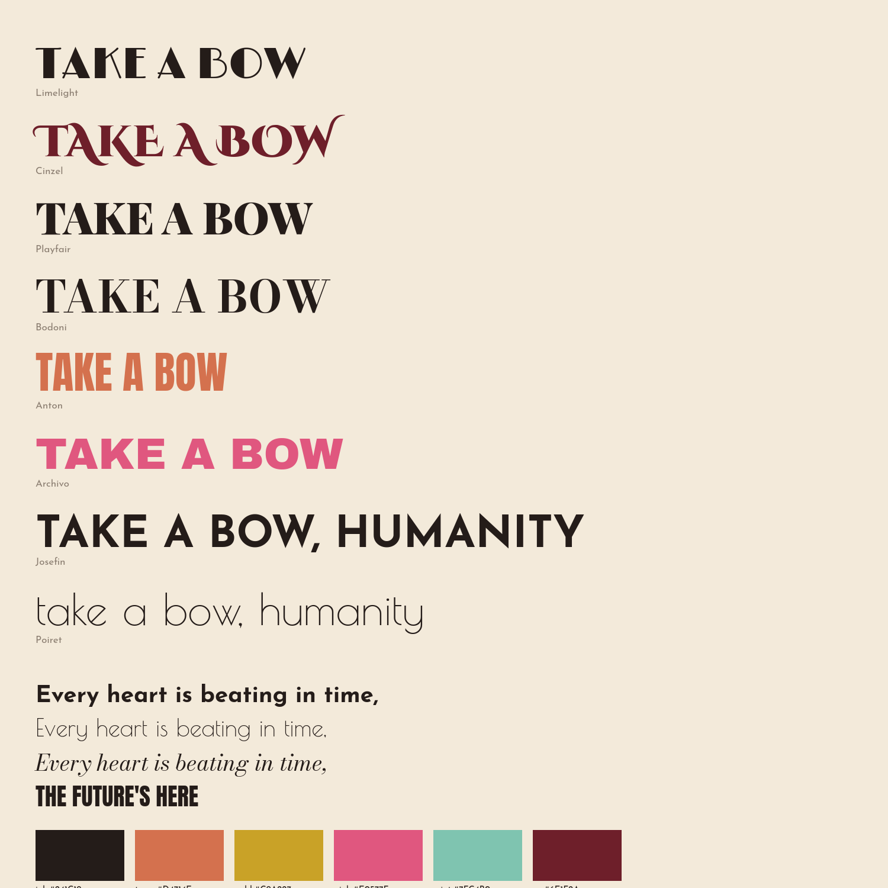

# Take a Bow, Humanity — *The Last Revue*

A 3:42 music video, rendered entirely in JavaScript. No video-generation models, no
stock footage, no external assets: every frame is drawn procedurally to an HTML canvas
in Node and muxed against the original audio.



## The idea

The song is a big-band swing villain number — an AI addressing humanity, delighted,
as it takes over. The arrangement is 1920s to its bones (stride piano, clarinet and
tenor solos, brass stabs, a gang-vocal finale), so the visual language is the music's
native one: **Art Deco**, not as pastiche but as period.

The thesis that organises every design decision:

> **Hand-cut paper Deco, progressively consumed by machine-perfect geometry.**

The ornament starts hand-made — deckled edges, ink bleed, off-register plates, a grain
that boils. As the song escalates, the curves get *too* exact, the symmetry *too*
clean, the repetition *too* fast. By the finale the artwork has been automated. That
is the song's argument, told in style rather than stated.

## The character

**THE HEADLINER** is a paper cut-out silhouette in the tradition of Lotte Reiniger's
*The Adventures of Prince Achmed* (1926) — the first surviving animated feature, made
from cut paper on a lightbox. The technique is period-correct, it is literally a paper
medium, and it is dramatically right for a villain who reveals herself slowly.

She carries Claude's 11-ray sunburst as a Deco headdress fanning up behind the skull,
so her profile stays on the clean outer contour. She is rigged parametrically —
shoulder/elbow arms, gown flare, train sweep, head tilt — and her **jaw is driven by
measured vocal salience**, which in silhouette animation is the whole of lip-sync.

## Timing

The lyric sheet says 170 BPM. It isn't.

Autocorrelation of the onset envelope and a comb-filter sweep both land on
**99.53 BPM** (beat 0.6028 s, bar 2.4113 s, first downbeat 2.1099 s). Everything —
bar grid, shot cuts, camera punches, section boundaries — is built on the measured
tempo, not the stated one.

Structure was recovered from the audio rather than assumed:

| signal | method | what it gave |
|---|---|---|
| section map | stereo centre/side dominance | 12 vocal regions, 12 band regions |
| the bridge | 6.84 s kick dropout at 152.85 s | the half-time villain reveal, pinned exactly |
| the spoken intro | 6 detected phrases, 4.26–12.24 s | one cue per spoken fragment |
| per-frame drive | band energies, vocal salience, onset flux | mouth, beat punch, reactive ornament |

`tools/verify_timing.py` renders every lyric cue over the vocal-salience curve, which
is how the 59 cues were checked rather than guessed.

## Craft notes

- **Paper** — procedural stock: fibre streaks, foxing, tooth, plate vignette, torn
  deckle edge. Built once per render, composited per frame.
- **Grain boil** — 6 noise plates cycled at 15 fps under a 30 fps picture, the way
  hand-drawn animation breathes.
- **Misregistration** — hero type prints pink and mint plates off-register under the
  ink pass, settling into alignment as the word lands. It is what sells "printed".
- **Tone** — three grounds (`paper` / `night` / `blaze`) carry the arc in *value*, not
  just hue: charming cream → true dark when she turns → blazing gold for the finale.
- **Shots** — wide / medium / close, cut on bar lines. On tight shots the lyric
  inverts to cream on a plate, because dark type dies on a full-frame silhouette.
- **Type** — five faces, each with a job: Limelight (playbill), Josefin Sans (the
  lyric voice), Anton (the machine), Bodoni Moda (the programme), Poiret One (the aside).

## Build

```bash
npm install
node tools/fonts.mjs                 # woff2 -> ttf for node-canvas
python3 tools/analyze_audio.py       # beat grid, sections
python3 tools/tempo2.py              # refine tempo + downbeat
python3 tools/vocal.py               # centre-channel vocal isolation
python3 tools/drive.py               # per-frame animation drive data
bash   tools/render.sh               # 4-worker parallel render -> H.264 + audio
```

Review loops:

```bash
node tools/contact.mjs 4 <t> <t> …   # contact sheet straight from the renderer
bash tools/review.sh out/x.mp4 0 222 16 4   # sample the encoded video
python3 tools/verify_timing.py       # lyric cues over the vocal curve
node tools/styleboard.mjs            # the style sheet
```

## Layout

```
audio/track.mp3        the source audio, untouched
analysis/              tempo, sections, per-frame drive data, verification plots
src/
  timeline.mjs         24 sections, 59 lyric cues
  render.mjs           frame loop, camera, transitions
  scenes.mjs           22 scenes
  core/                paper, ink, type, backdrops, tone, stage, noise
  character/           the Headliner + chorus line
tools/                 analysis, render, review
```

## A note on what this isn't

The original plan called for Seedance 2.5 image and video generation via fal as a
base layer to draw over. `fal.ai` is blocked by this environment's network policy, so
the piece is built entirely from procedural drawing instead. Everything on screen is
the JavaScript layer — which was always the intended final image.
