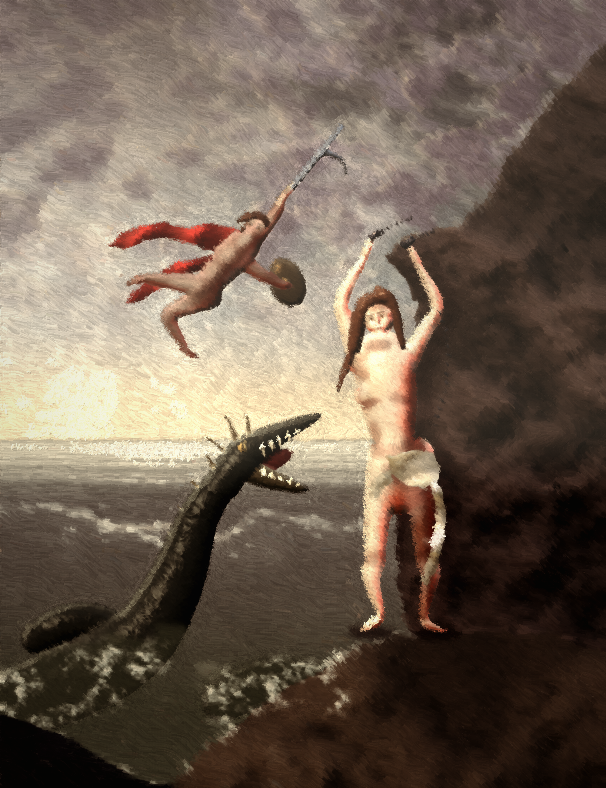

# Perseus Delivering Andromeda

An oil painting, made by hand on a digital canvas. No image model was used and
no photograph or reference image was loaded: every form in the picture is
sculpted, lit and then brushed on, stroke by stroke, by the code in this
directory.



## What "manually" means here

The pipeline is the order a nineteenth-century painter would work in, and each
stage is a separate file.

| stage | file | what happens |
|---|---|---|
| the paint box | `engine.py` | pigments, a primed linen weave, a bristle brush that leaves ridges, glazes, scumbles, varnish |
| the sculpture | `sculpt.py` | a 2.5-D depth buffer with spheres, eggs and spline **tubes**; normals, occlusion, materials |
| the picture | `scene.py` | sky, sea, the crag, the ledge — composition, light and palette |
| the figures | `figures.py` | Andromeda, Perseus, Cetus: armature, anatomy relief, faces, hair, drapery, the modelling pass |
| assembly | `compose.py` | everything in its plane, back to front: the underpainting |
| the brushwork | `paint.py` | ground, dead colour, blocking, modelling, drawing, blending, cutting in, accents, finishing |

The underpainting (`out/perseus_andromeda_under.png`) is never what gets shown.
It is a lay-in. What gets shown is paint.

## The palette

A restricted studio palette, mixed by recipe rather than picked as RGB —
lead white, Naples yellow, yellow ochre, raw and burnt sienna, light red,
madder, alizarin, terre verte, viridian, ultramarine, Prussian, cobalt,
cerulean, the umbers, Vandyke brown, ivory black. `mix('lead_white', 6,
'naples', 1.5, 'light_red', 1.05, 'ochre', 0.4)` is the flesh tone, and it
mixes slightly subtractively, the way paint does.

## Craft notes

- **Flesh** is not Lambert shading. The shader carries a subsurface band that
  fires where the light dies on the form — the reddish halftone at the
  terminator. Without it skin reads as plastic; it is the whole secret of
  salon flesh painting.
- **Limbs** are spline tubes, not tapered cylinders: position *and* radius run
  through a Catmull-Rom spline and are drawn as a dense row of ellipsoids, so a
  calf swells and an ankle tapers. The big masses are blocked in, unified with
  a mask-aware blur (the sculptor's thumb), and then the secondary forms —
  breasts, kneecaps, the face — are set on afterwards so they stay crisp.
- **The modelling pass** (`figures.Mod`) is the part a painter actually does by
  hand: forty-odd shadow, light and reflected-light shapes drawn onto the
  shaded figure. Shadows multiply (warm and transparent), lights cover,
  reflections add.
- **Counterchange** is built, not hoped for. A bank of cloud is drawn in behind
  Andromeda's lit side and a shaft of light is thrown on the crag behind her
  shadow side, so the figure tells against its ground on both edges.
- **Cutting in**: a loaded brush drags light paint off a figure into the dark
  behind it. Three passes of decreasing size repaint the background up to the
  contour, which is how the halo is killed.
- **Impasto is real geometry.** The canvas carries a thickness buffer as well
  as a colour buffer; every stroke deposits paint height, and the finish rakes
  a light across it. The weave only shows where the paint is thin.
- **Finishing** is glazing, not filtering: a warm transparent glaze in the
  shadows, a cooler one on the stone, aerial perspective on the distance, then
  varnish, craquelure and the faint darkening at the corners that every old
  picture has.

## The subject

Perseus comes down the diagonal out of a break in the storm, harpe raised.
Andromeda is chained to the crag at Joppa, the brightest and highest-chroma
passage in the picture; everything else is keyed down to serve her. Cetus rears
out of the lower left on a long neck — the picture's bass note, and the line of
its back carries the eye back up the diagonal to Perseus.

## Running it

```
pip install numpy pillow scipy
python3 final.py 1.0 ../out/perseus_andromeda.png   # 2000 x 2600, ~6 min
python3 final.py 0.4 /tmp/sketch.png                # a quick study
```

The single argument is the scale: all geometry is written in 2000 x 2600
units and scaled at render time, so a study and the finished canvas are the
same painting.
